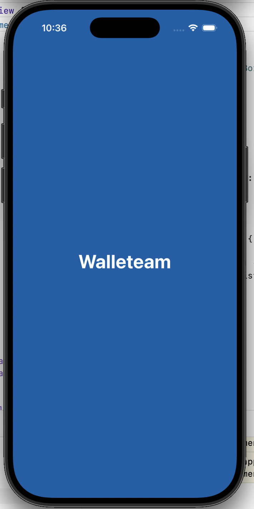
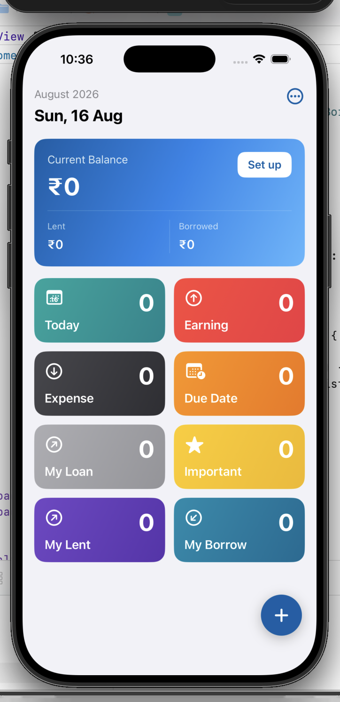
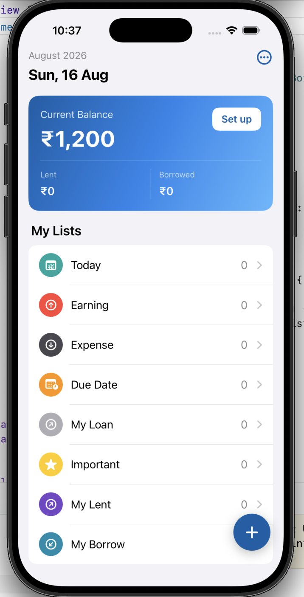
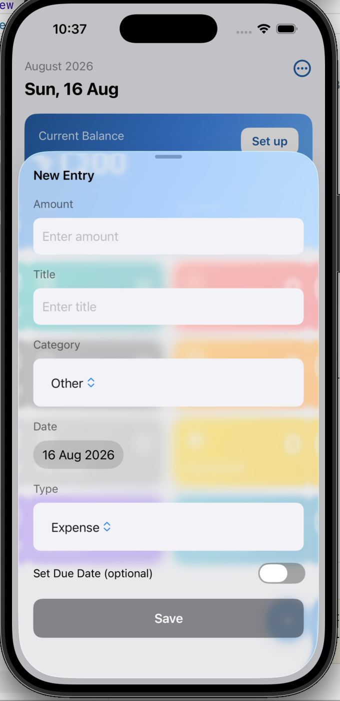

# Walleteam

A simple personal money tracker app built with SwiftUI.
Track your monthly earnings, expenses, and money lent or borrowed — all stored locally on your device.

## Features

- Track this month's earnings and expenses
- See profit/loss at a glance
- Track money lent to and borrowed from people
- Current balance overview
- 100% offline — no API, no backend, all data stored locally

## Screenshots

  
  
  
  

## Built With

- SwiftUI
- SwiftData (local storage)
